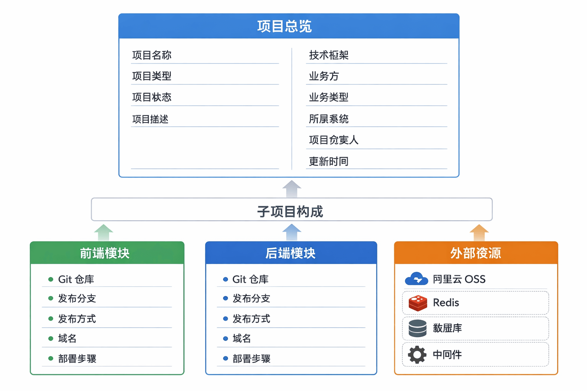
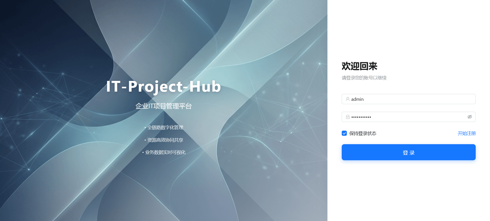
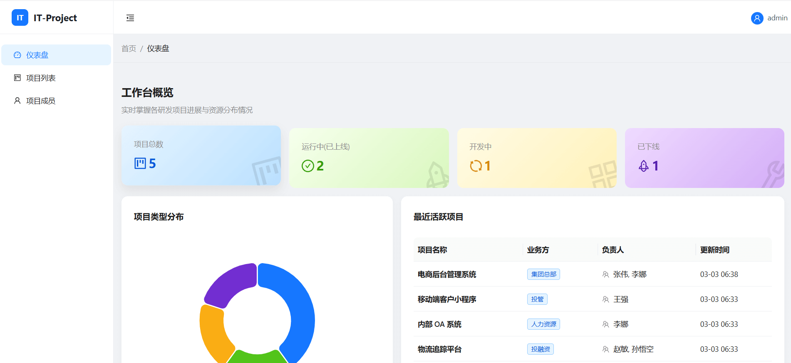
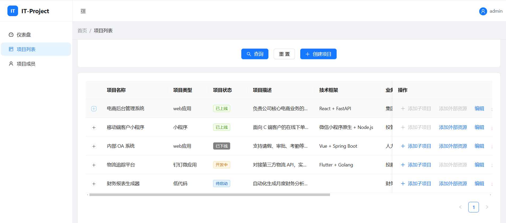
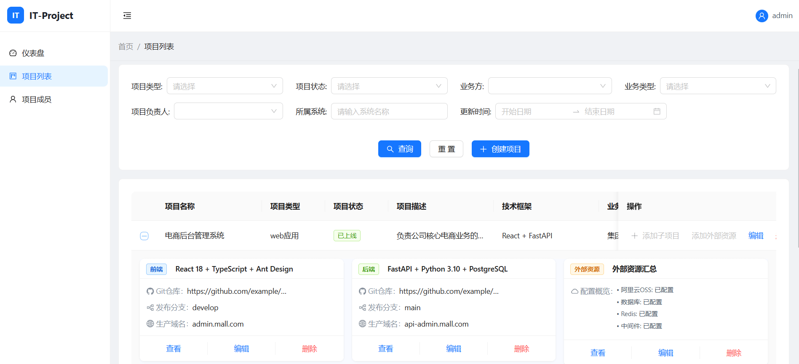

# IT-Project-Console (企业IT项目管理平台)

## 项目背景

通常在企业中一个完整的项目会先有一个项目的基本信息（包括项目名称、项目类型、项目状态、项目描述、技术框架、业务方、 业务类型 、所属系统 、项目负责人 、更新时间等） 和 下面的子项目构成。

**子项目**又分为： 前端 + 后端 + 外部资源

**前端和后端**包括的基本信息是一致的：有 git仓库、发布分支、发布方式、域名、部署步骤等

**外部资源**又有阿里云OSS、Redis、数据库、中间件等子资源。



所以当前系统就是把这内容归纳到一起，便于维护和使用。

## 项目截图

**登录页**


**仪表盘**


**项目列表**


**项目列表-展开**


## 技术栈

### 前端 (Frontend)

- **核心框架**: React 18 + TypeScript
- **构建工具**: Vite
- **UI 组件库**: Ant Design 5.0 + Tailwind CSS
- **数据可视化**: ECharts
- **路由管理**: React Router v6
- **HTTP 请求**: Axios

### 后端 (Backend)

- **核心框架**: FastAPI (Python 3.10+)
- **ORM 框架**: SQLAlchemy 2.0
- **数据库**: MySQL 5.7/8.0 (通过 PyMySQL 连接)
- **身份认证**: OAuth2 + JWT (Jose)
- **数据验证**: Pydantic v2

## 目录结构

```
pro-manage-2/
├── backend/                # 后端项目目录
│   ├── app/                # 应用核心代码
│   │   ├── api/            # API 路由接口
│   │   ├── core/           # 核心配置 (Config, Security)
│   │   ├── db/             # 数据库连接与会话
│   │   ├── models/         # SQLAlchemy 数据模型
│   │   ├── schemas/        # Pydantic 数据验证模型
│   │   └── main.py         # 程序入口
│   ├── init_db.py          # 数据库初始化脚本
│   ├── seed_data.py        # 演示数据填充脚本
│   ├── reset_db.py         # 重建表结构并重新灌入演示数据
│   ├── init_data.sql       # 已废弃，保留说明用途
│   └── requirements.txt    # Python 依赖清单
├── frontend/               # 前端项目目录
│   ├── src/                # 源代码
│   │   ├── components/     # 公共组件
│   │   ├── pages/          # 页面视图
│   │   ├── services/       # API 请求服务
│   │   └── utils/          # 工具函数
│   └── vite.config.ts      # Vite 配置
├── docs/                   # 项目文档
├── start_dev.bat           # Windows 快速启动脚本 (仅启动服务)
└── setup_and_start.bat     # Windows 一键初始化与启动脚本 (含依赖安装、数据初始化)
```

## 快速开始

### 方式一：极速初始化 (推荐)

如果您在 Windows 环境下，并且已安装好 Python、Node.js 和 MySQL，可以直接运行根目录下的 `setup_and_start.bat` 脚本。

该脚本会自动执行以下操作：
1. 检查环境依赖
2. 安装后端 Python 依赖
3. 初始化数据库表结构并按需填充演示数据
4. 安装前端 pnpm 依赖
5. 启动前后端服务

### 方式二：手动分步启动

### 1. 环境准备

- Node.js (v16+)
- Python (v3.10+)
- MySQL (v5.7/v8.0)
- pnpm (推荐) 或 npm/yarn

### 2. 数据库配置

1. 创建 MySQL 数据库 `proman`。
2. 确认 `backend/app/core/config.py` 中的数据库连接配置，或创建 `backend/.env` 文件覆盖默认配置：
   ```env
   MYSQL_USER=root
   MYSQL_PASSWORD=your_password
   MYSQL_SERVER=localhost
   MYSQL_PORT=3306
   MYSQL_DB=proman
   ```

### 3. 后端启动

1. 进入 backend 目录:
   ```bash
   cd backend
   ```
2. 安装依赖:
   ```bash
   pip install -r requirements.txt
   ```
3. 初始化数据库表结构:
   ```bash
   python init_db.py
   ```
4. 填充演示数据 (包含默认管理员账户):
   - 仅重灌演示数据:
     ```bash
     python seed_data.py
     ```
   - 高风险重建表结构并重新初始化:
     ```bash
     python reset_db.py --confirm RESET
     ```
   - `backend/init_data.sql` 已废弃，不再用于当前结构化外部依赖表。

5. 运行服务:
   ```bash
   uvicorn app.main:app --reload --port 8000
   ```
   后端服务将运行在 `http://127.0.0.1:8000`

### 4. 前端启动

1. 进入 frontend 目录:
   ```bash
   cd frontend
   ```
2. 安装依赖:
   ```bash
   pnpm install
   ```
3. 启动开发服务器:
   ```bash
   pnpm run dev
   ```
   访问控制台输出的本地地址 (通常为 `http://localhost:3000` 或 `http://localhost:5173`)

## 默认账户

- **用户名**: `admin`
- **密码**: `admin123!@#`

## 功能模块

- **仪表盘**:
  - 项目状态概览（开发中、已上线、已下线等）
  - 核心指标统计卡片
  - 项目类型分布图表
  - 最近活跃项目列表
- **项目管理**:
  - 项目列表查询与筛选
  - 新建/编辑项目（支持 Web应用、钉钉微应用、小程序、低代码等类型）
  - 关联资源管理（前端/后端代码仓库、部署信息）
  - 外部资源配置（数据库、OSS、Redis 等）
- **成员管理**:
  - 项目成员信息维护
  - 技能栈与联系方式管理
- **系统管理**:
  - 用户登录/注册
  - 权限认证

## License

MIT License. See [LICENSE](LICENSE) file for more information.
